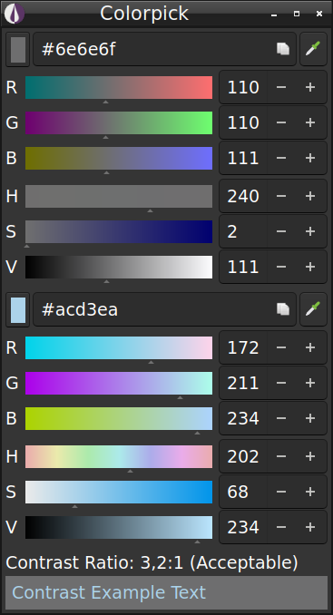

# Colorpick: Color picker and contrast checker



Colorpick is a color picker, which makes it easy to check text readability by
letting you pick a background and foreground color and computing the contrast
between them.

It lets you know if contrast is good enough according to
<http://www.w3.org/TR/WCAG20/#visual-audio-contrast>.

It also comes with a handy magnified-picker, which you can control with the
cursor keys, for precise picking.

Finally, it lets you adjust colors and copy them to the clipboard as different
formats.

Currently, working only under X11 based systems.

## Requirements

- CMake
- Qt 5/6

## Installation

Create a build directory and change to it:

```bash
mkdir build
cd build
```

By default, Qt5 is used for build, otherwise change it by adding `-DPROJECT_QT_VERSION=6`
to the following CMake configure command:

```bash
cmake path/to/colorpick
make
```

Install (must be run as root if installing to /usr or /usr/local):

```bash
make install
```

## Translations

To contribute language translations, you can use Qt Linguist and/or manually:

- Copy `resource/translations/colorpick.ts` language template to
  `resource/translations/colorpick_<country-code>.ts`, e.g.: `colorpick_de.ts`
- Set the language in the file:
  from `<TS version="2.1">` to `<TS version="2.1" language="de">`
- Translate it and the `resources/freedesktop/colorpick.desktop` file by adding
  e.g.: `GenericName[de]`, `Comment[de]` and optionally `Name[de]`
  (see the existing translations as reference)
- Create a Pull Request with your changes.

## Authors

See the [AUTHORS](AUTHORS) file.

## License

[BSD-3-Clause-Clear](https://spdx.org/licenses/BSD-3-Clause-Clear.html)
